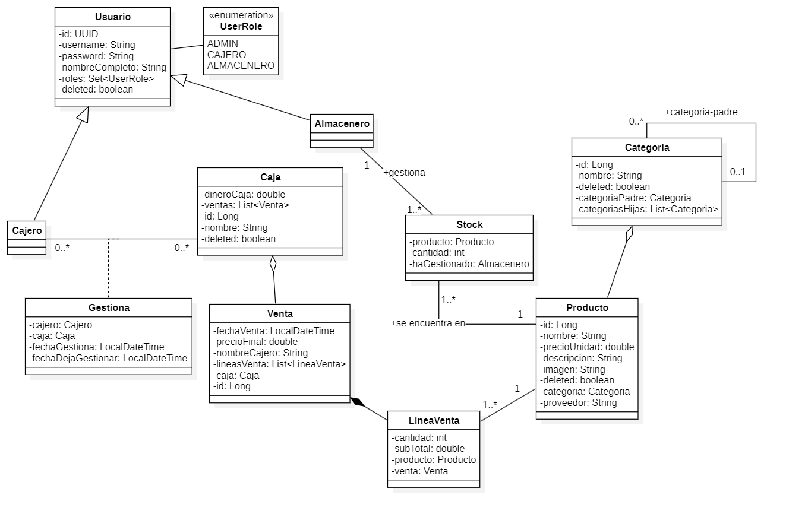

# Delight-Nook

## Descripción del proyecto:

Delight-Nook es una tienda dedicada a la venta de productos varios relacionados con la cultura oriental, parecida a la tienda Miniso.

Este proyecto está dedicado para solucionar la gestión de dicha tienda. Gestionando las ventas y el stock de sus productos.

## Instrucciones para iniciar el proyecto:

- ### Requerimentos
    Para iniciar este proyecto se necesitan estos requerimentos:
    - Tener docker instalado

    - Tener una API KEY en SendGrid

    - Darle valor a las siguientes variables de entorno en el fichero docker-compose.yml en el apartado de **_app_**
    
            app:

                container_name: delight-nook-app
                build: .
                ports:
                    - "8080:8080"
                environment:
                    SECRET:
                    SENDGRID_API_KEY:
                    SPRING_DATASOURCE_URL:
                    SPRING_DATASOURCE_USERNAME:
                    SPRING_DATASOURCE_PASSWORD:
    
        
        - SECRET: Tendrá que proporcionar un conjunto de carácteres varios para que se establezca el código de seguridad de los token que se vayan a generar
        
        - SENDGRID_API_KEY: Tendrá que proporcionar su api key de sendgrid para implementar el autoenviado de los correos a los usuarios que se vayan a registrar
        
        - SPRING_DATASOURCE_URL: Tendrá que proporcionar una url en la que se encuentre alojado su servidor y base de datos de postgresql. ej: _**"jdbc:postgresql://localhost:5433/Delight-Nook"**_

        - SPRING_DATASOURCE_USERNAME: Tendrá que proporcionar el nombre de usuario del servidor en el que esté alojada su base de datos

        - SPRING_DATASOURCE_PASSWORD: Tendrá que proporcionar la contraseña del servidor en el que esté alojada su base de datos

     - Ejecutar docker-compose up -d en la raíz del proyecto

## Datos a tener en cuenta

- Las peticiones se encuentran en el fichero de postman incluido, además que están documentadas en swagger-ui; para consultar la documentación deberá incluir en su buscador: _**"url-base"/swagger-ui/index.html**_
- El orden de las peticiones está más o menos implementadas en el orden en el que se deberían de ejecutar

## Diagrama de clases del diseño

